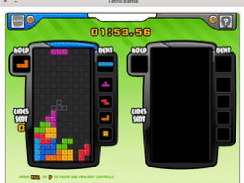
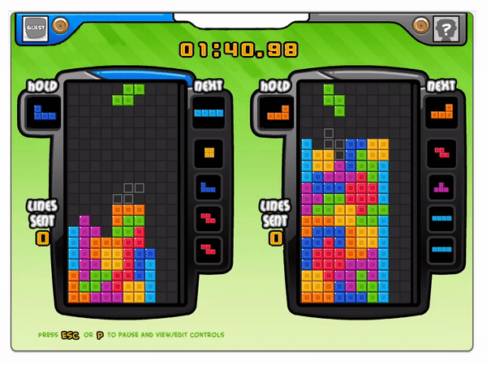

# **TetrisBattle**

This project is to reproduce the popular Facebook game -- Tetris Battle (Not available playing online now). I also offer the wrapper of the game for training AI agent.

It is a highly restored version of original game, with features as follow: <br/>
- 2 players <br/>
- UI (credits to https://github.com/xuyuwei/tetris-battle) <br/>
- T spin and Tetris (parts credits to https://github.com/xuyuwei/tetris-battle) <br/>
- back to back <br/>
- garbage lines (parts credits to https://github.com/xuyuwei/tetris-battle) <br/>
- alarm for attacks <br/>

The repository contains:

1. Single player mode
2. Two players mode
3. Wrapper for training AI agent, wrapped as OpenAI [gym](https://github.com/openai/gym) environment. (tetris_single_wrapper.py)

## **Demo**


### Single player

demo the fuctions: tspin and back to back.



### Two players

demo the functions: tetris, combo and ko.



## **Requirements**
```
python3 
pygame 
Linux system 
```

Note that pygame might have conflicts with macOS. <br/>

In my case, the program works well on macOS 10.14.6 with `pygame==2.0.0.dev1` and `python==3.7.4`. However, it breaks with `pygame==1.9.4`.

## **How to play**

### Single player

```
python tetris_game.py --mode single
```

### Two players

```
python tetris_game.py --mode double
```

## **Disclaimer**

This work is based on the following repos: <br/>
1. https://github.com/xuyuwei/tetris-battle

## **Contact**
Yi-Lin Sung, r06942076@ntu.edu.tw